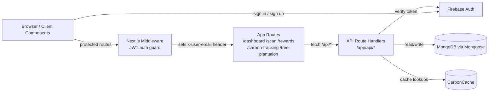

# EcoVerse Architecture Guide

## Overview

This document provides a high-level overview of the EcoVerse codebase to help contributors quickly understand the project structure and navigate the repository efficiently.

---

## Frontend Directory

### `/app`

The `app` directory contains the main application routing, pages, layouts, and views.

Responsibilities include:

- Application routing
- Page rendering
- Layout management
- Navigation flow
- Feature-specific pages

This directory serves as the primary entry point for the Next.js application.

### `/components`

The `components` directory contains reusable UI components used throughout the application.

Examples include:

- Navigation bars
- Buttons and form controls
- Custom input fields
- Scanner interface components
- Shared UI elements

Using reusable components helps maintain consistency and reduces code duplication.

---

## Backend & Database Layer

### `/models`

The `models` directory contains MongoDB schema and model definitions used by the application.

Examples include:

- `User.ts`
- Future product-related models

These models define how data is structured and stored within MongoDB.

### `/lib`

The `lib` directory stores shared utilities, helper functions, and configuration files used throughout the project.

Examples include:

- MongoDB connection helpers
- Firebase configuration
- Carbon footprint calculations
- Packaging analysis utilities
- Reward system logic
- General helper functions

Keeping shared logic in one place improves maintainability and reusability.

---

## Sync & Build Outputs

### `/firebase-functions-sync-ts`

This directory is used for Firebase synchronization workflows and related build outputs.

**Important Notes**

- May contain compiled JavaScript (`.js`) files
- May contain source map (`.js.map`) files
- Generated during build or synchronization processes

⚠️ **Do NOT edit compiled output files directly.**

Always modify the original source files whenever changes are required.

### `/linkFBtoMDB`

This directory contains scripts used to synchronize Firebase and MongoDB data.

Examples include:

- User synchronization scripts
- Firestore migration utilities
- Database synchronization helpers

**Important Notes**

- Some files may be generated or compiled outputs
- Do not directly edit compiled `.js` or `.js.map` files
- Update the original source files whenever applicable

⚠️ **Do NOT edit compiled output files directly.**

---

## System Architecture

EcoVerse is a single Next.js application that handles both the UI (server and client components) and the API layer (route handlers under `/app/api`). The browser talks to these route handlers, which read and write user data in MongoDB via Mongoose models. Firebase is used for authentication, while a JWT is stored in a cookie and verified by middleware on every protected request.

### System Architecture Diagram



### Frontend ↔ Backend Communication

- The UI is rendered by Next.js App Router pages under `/app`. Pages marked `'use client'` call API route handlers with the browser `fetch` API.
- API routes live under `/app/api` (e.g. `/api/user/score`, `/api/rewards`, `/api/user/tree-plantation`).
- Requests are identified by the `x-user-email` header. **This header is never trusted from the client** — it is injected by `middleware.ts` only after verifying the `auth_token` cookie (see Authentication Flow below).
- Responses are JSON. The frontend updates local React state from the returned payload.
- The app opts out of static generation for data routes (`export const dynamic = 'force-dynamic'`) so every request hits the live database.

### Database Schema Overview

Data is stored in MongoDB and modelled with Mongoose schemas in `/models`.

- **`User`** (`models/User.ts`) – the central document. Key fields:
  - Identity: `name`, `email`, `firebaseUid`, `authProvider`, `avatarId`
  - Carbon tracking: `monthlyCarbon`, `monthlyCarbonGoal`, `totalScanned`, `scans[]`, `lastMonthlyReset`, `monthlyCarbonHistory[]`
  - Rewards: `rewardPoints`, `confirmedPoints`, `unconfirmedPoints`, `rewardTransactions[]`, `achievements[]`, `level`, `purchasedItems[]`, `streakProtectors`, `doublePointsDays`, `hasAdvancedAnalytics`, `activeBadges[]`
  - Tree plantation (Issue #241): `treePlantations[]` (each entry has `date`, `treesPlanted`, `location`, `treeType`, `notes`, `carbonOffset`)
  - Embedded sub-schemas: `Scan`, `RewardTransaction`, `Achievement`, `MonthlyCarbonArchive`, `PurchasedItem`, `TreePlantation`
- **`CarbonCache`** (`models/CarbonCache.ts`) – caches product carbon-footprint lookups to avoid recomputing estimates.

### Authentication Flow

1. A user signs in or signs up through Firebase Auth (UI in `/app/auth` and `/components/google-signin-button.tsx`).
2. The issued credential is exchanged for a JWT, which is stored in the `auth_token` HTTP-only cookie.
3. On every request, `middleware.ts` checks the cookie:
   - If the route is protected (`/dashboard`, `/scan`, `/rewards`, `/carbon-tracking`, and any others added) and no valid token exists, the user is redirected to `/signin`.
   - If a token exists, `verifyToken()` validates it. On success the verified email is set as the `x-user-email` request header; any client-supplied `x-user-email` is stripped first to prevent spoofing.
4. API route handlers read `x-user-email` to load the correct `User` document.

### Folder Structure Explanation

```text
EcoVerse/
├── app/                  # Next.js App Router: pages + API route handlers
│   ├── api/              # Backend route handlers (auth, user, rewards, scan...)
│   ├── auth/             # Sign in / sign up pages
│   ├── dashboard/        # Main dashboard view
│   ├── scan/             # Product barcode scanner
│   ├── carbon-tracking/  # Monthly carbon footprint tracking
│   ├── rewards/          # Rewards & achievements
│   ├── leaderboard/      # Community rankings
│   ├── analytics/        # Charts and insights
│   └── tree-plantation/  # Tree plantation progress tracker (#241)
├── components/           # Reusable UI (dashboard-layout, scanner, ui/*)
├── lib/                  # Shared logic: carbon-calculator, rewards-system,
│                        #   streak-system, monthly-cycle, mongodb, firebase, auth
├── models/               # Mongoose schemas (User, CarbonCache)
├── middleware.ts         # JWT auth guard for protected routes
├── public/               # Static assets
└── ARCHITECTURE.md       # This document
```

---

## Tech Stack Reference

EcoVerse is built using:

- **Next.js** – Application framework and routing
- **TypeScript** – Type-safe development
- **Tailwind CSS** – Utility-first styling framework
- **MongoDB** – Database layer
- **Firebase Auth** – User authentication and identity management

---

## How to Contribute (Step by Step Guide)

### Standard Git Workflow

1. Fork this repository to your GitHub profile.

2. Clone your forked repository to your local system.

3. Create a new feature branch:

   ```bash
   git checkout -b docs/architecture-guide
   ```

4. Add the required documentation file.

5. Commit your work with a meaningful commit message:

   ```bash
   git commit -m "docs: add central codebase architecture guide"
   ```

6. Push your branch to your fork.

7. Open a Pull Request (PR) against the main repository.

### GitHub Browser Workflow (No Git/Terminal Needed)

1. Fork this repository to your GitHub profile.
2. Open your fork on GitHub.
3. Click **Add file** → **Create new file**.
4. Name the file `ARCHITECTURE.md`.
5. Paste your documentation into the editor.
6. Commit the changes.
7. Create a new branch and open a Pull Request.

---

## Notes for Contributors

- Follow the existing project structure when adding new features.
- Reuse components and utilities whenever possible.
- Write documentation in clear, beginner-friendly language.
- Prefer using backticks when referencing folder paths and file names.
- Do not modify, delete, or refactor existing code unless the issue specifically requires it.
- Do not edit generated build outputs directly.
- Keep documentation updated when introducing major architectural changes.

---

This guide serves as a starting point for contributors and should be updated as the project evolves.
